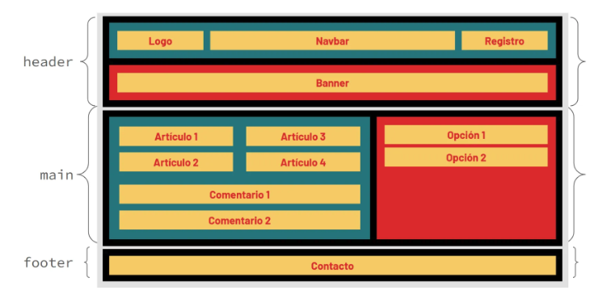
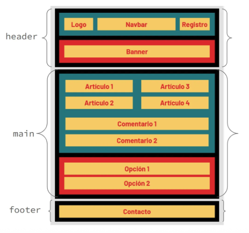
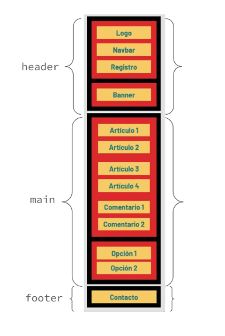

# PRACTICANDO HTML5 & CSS3 

## Objetivos
Diseñar componentes básicos en HTML y darles estilos y posición con CSS

##  Competencias técnicas
Maquetación web.

##  Herramientas
<ul>
  <li>Visual Studio Code</li>
  <li>HTML5</li>
  <li>CSS3</li>
</ul>
## Instrucciones

Desarrolla una página web básica tal como te muestra la maqueta.

## 1.Réplica 
#### Tamaño Desktop.

## 2.Réplica 
#### Tamaño Tablet. En el mismo archivo de HTML5 que has creado anteriormente y mediante media queries en CSS3 haz que la estructura que tienes se transforme como la siguiente imagen cuando tiene un tamaño de Tablet.

## 3.Réplica 
#### Tamaño Mobile. En el mismo archivo de HTML5 que has creado anteriormente y mediante media queries en CSS3 haz que la estructura que tienes se transforme como la siguiente imagen cuando tiene un tamaño de Mobile.

## Requisitos
- Tamaño de letra: 32px
- Fondo de toda la página color: #E5E5E5
- Para el resto de colores encontrar exactamente los mismos de la presentación (investiga como hacerlo)
- Textos alineados al centro
- Tipo de letra: Barlow
- Peso de la letra: negrita (bold)
- Usar Flexbox

## Guía de Tamaños
<ul>
  <li> Mobile: hasta 576px</li>
  <li> Tablet: entre 768px a 992px</li>
  <li>
 Desktop: entre 1200 a 1440px</li>
</ul>

